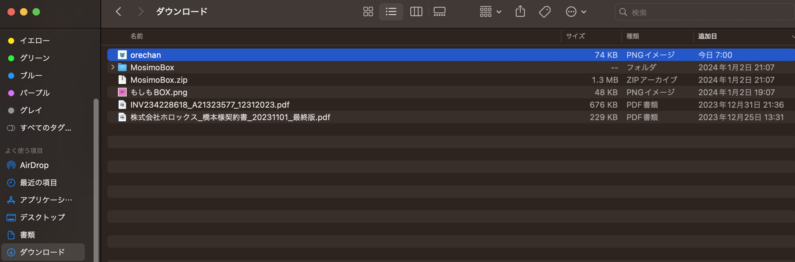

# genってフォルダとは?

## 読んでほしい人
- よくみるgenってフォルダがわからない?

## 記事の内容
昔からあるパッケージもありますが私使ってないですね笑:

https://pub.dev/packages/asset_manager_cli

これが今回使うパッケージ!
https://pub.dev/packages/flutter_gen
>アセット、フォント、色などの Flutter コード ジェネレーター — すべての文字列ベースの API を削除します。

アセット パス文字列を直接使用するのは安全ではありません。
```yaml
# pubspec.yaml
flutter:
  assets:
    - assets/images/profile.jpg
```

❌ Bad
タイプミスをした場合はどうなりますか?
```dart
Widget build(BuildContext context) {
  return Image.asset('assets/images/profile.jpeg');
}

// The following assertion was thrown resolving an image codec:
// Unable to load asset: assets/images/profile.jpeg
```

⭕️ Good
We want to use it safely.
```yaml
Widget build(BuildContext context) {
  return Assets.images.profile.image();
}
```

## 🎁Installation
どうやらインストールしないと使えないらしい?

Homebrew
Works with macOS and Linux.

```bash
brew install FlutterGen/tap/fluttergen
```

Pub Global
Works with macOS, Linux and Windows.

```bash
dart pub global activate flutter_gen
```

### 📄yamlファイルの解説と使い方

アセット パス文字列を直接使用するのは安全ではありません。

パスを設定する必要がある場合があります。

build_runner の一部として
1. build_runner と FlutterGen をパッケージの pubspec.yaml ファイルに追加します:

```yaml
dev_dependencies:
  build_runner:
  flutter_gen_runner:
```

2. FlutterGenをインストールする
```bash
flutter pub get
```

3. FlutterGenを使用する
```bash
dart run build_runner build
```

### 🪛使用方法
pubspec.yaml を構成した後、fluttergen を実行します。`pubspec.yaml`は、プロジェクト直下にあるので、`./pubspec.yaml`で実行する。
```yaml
fluttergen -h

fluttergen -c ./pubspec.yaml
```

### ⚙️設定ファイル
FlutterGen は、pubspec.yaml のキー flutter と flutter_gen に基づいて dart ファイルを生成します。
デフォルトの構成はここにあります。

```yaml
# pubspec.yaml
# ...

flutter_gen:
  output: lib/gen/ # Optional (default: lib/gen/)
  line_length: 80 # Optional (default: 80)

  # Optional
  integrations:
    flutter_svg: true
    flare_flutter: true
    rive: true
    lottie: true

  colors:
    inputs:
      - assets/color/colors.xml

flutter:
  uses-material-design: true
  assets:
    - assets/images/

  fonts:
    - family: Raleway
      fonts:
        - asset: assets/fonts/Raleway-Regular.ttf
        - asset: assets/fonts/Raleway-Italic.ttf
          style: italic
```

公式の解説が長く続くので、これぐらいにして、使い方としては、決まった設定をすればパスを指定しなくても画像、svg、フォントを読み込んでくれるらしい。パスを指定せずにFlutterのWidgetで呼び出せる便利なツールらしい?

このパッケージも追加して使ってみよう!
https://pub.dev/packages/build_runner

### 今回は、画像とGoogleFontsを使ってみましょう!
png画像を用意する。


GoogleFontsの公式はこちら⬇️
https://fonts.google.com/


yamlファイルの設定と画像とGoogleFontsを配置したら、上で解説した公式のコマンドを実行します。

1. FlutterGenをインストールする
```bash
flutter pub get
```

2. FlutterGenを使用する
```bash
dart run build_runner build
```

## 最後に
今回は、最近よくみる`gen`ってディレクトリがなんなのか調べてみました!
画像やフォントを使いやすくしてくれるツールがあるなんてびっくりしましたね。このパッケージはあの有名なwasabeefさんが作っているようです。知らなかった...
まさか国産のパッケージだったとは!
https://wasabeef.medium.com/fluttergen-25149caea94f
